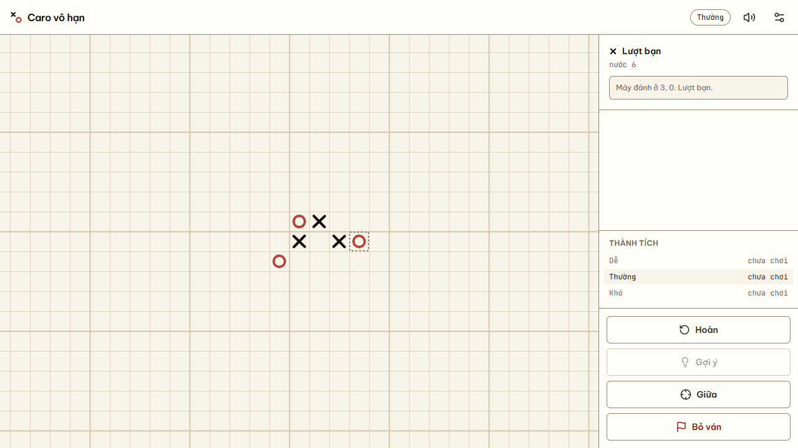

# ⭕✖️ Duck Caro — caro against the machine on a board with no edges

[](https://github.com/LeVanAnhDuc/web-game-duck-caro/actions/workflows/ci.yml)
[](https://github.com/LeVanAnhDuc/web-game-duck-caro/actions/workflows/deploy.yml)
[](https://github.com/LeVanAnhDuc/web-game-duck-caro/releases)

A Vietnamese-rules caro (gomoku) game you play against the machine, on a board that
never ends. Five in a row wins — unless your opponent has blocked both ends. Everything
is drawn in code on a canvas: no sprite sheet, no image files. No server, no sign-in.

**Play**: https://levananhduc.github.io/web-game-duck-caro/



**Status:** all 7 milestones are done. The game is playable, the opponent is real, a finished
game replays move by move, a whole game can be played with the keyboard alone, and the load
budget is measured rather than guessed — LCP 1.0s on a throttled 4G phone profile. See [`docs/04-state/backlog.md`](docs/04-state/backlog.md).

Releases and the Pages deploy are automated from `main`; the version comes from
Conventional Commit prefixes. The contract is in [`CLAUDE.md`](CLAUDE.md).

## Features

- **The board has no edges**

  - Drag to move, wheel to zoom, one button to fit every mark back on screen
  - Coordinates are integers and go negative; the first move of a game is `0, 0`
  - No board edge means "blocked" has exactly one meaning — an enemy mark, never a wall

- **Vietnamese caro rules, stated precisely**

  - Five or more in a row wins, judged on the maximal run through the last move
  - A run blocked by enemy marks at **both** ends does not win, however long it is
  - Six in a row wins when it is not blocked; six blocked at both ends does not
  - There is no draw: an unbounded board never runs out of cells

- **Play against the machine**

  - Choose who moves first; the machine answers every move
  - Undo takes back your move **and** the machine's reply
  - Resign closes the game when it is no longer worth finishing

- **Playable with the keyboard alone**

  - The board itself takes focus: arrows move a cursor, Enter places, Shift + arrows pan
  - `+` and `-` zoom, `Home` fits every mark back on screen, `h` hints, `u` undoes
  - The cursor drags the viewport along, because a board with no edges will otherwise
    leave it somewhere off screen
  - A second live region reads the cursor's coordinates **and whether that cell is
    taken** — before you commit, not after
  - Verified on the static build, not the dev server: Next's dev overlay sits in the tab
    order and would have measured the wrong thing

- **Sound, synthesised on the spot**

  - Four sounds built from oscillators — no audio files, because nothing may be fetched
    after the first load
  - Your move and the machine's differ in **pitch**, not in volume
  - If the browser blocks audio the game stays silent and keeps working; silence is a
    valid state, not an error path

- **Settings that belong to the machine, not to you**

  - Sound on or off, and the difficulty a new game starts at
  - Kept separately from saved games, so muting a work computer never mutes the one at
    home — even after accounts exist
  - Erasing everything lives here too, behind a confirmation that says plainly there is
    no copy anywhere

- **Every move is listed, and a finished game replays**

  - The right-hand panel lists every move with its coordinates, the newest always in view
  - When a game ends, "Xem lại" steps through it one move at a time, or jumps straight to
    any move in the list — read-only, so a replay can never branch the game
  - Hint asks the **hard** engine whatever difficulty you are playing: a hint from the
    deliberately blinded easy engine would be worse than no hint at all
  - The hint arrives as the same faint preview mark a touch tap makes, so one more click
    plays it — and the confirm button steps aside instead of covering a neighbouring mark

- **An opponent that actually plays**

  - Minimax with alpha-beta pruning, running in a Web Worker so the board never freezes
  - Evaluation is built around **open ends**, not run length: a five blocked at both ends
    is worth nothing, and broken shapes like `x x . x` count as the threats they are
  - Three difficulties that differ in search depth, time budget and one more thing —
    **Easy is weakened by occasionally not seeing your threat at all**, because a
    shallower search still blocks perfectly and would never feel easy
  - Hard reaches depth 6 inside its 1.5s budget; Easy answers in under 10ms
  - Every level is reproducible from a seed, so a bug found while playing can be replayed

- **Marks are told apart by shape, not by colour**

  - You play `X`, the machine plays `O`, drawn as pen strokes with a slight lean
  - Shape carries the meaning, so a greyscale screenshot still reads correctly
  - The winning five gets a pen stroke through it, cased so it stays visible where it
    crosses a mark

- **Reads as a sheet of graph paper**

  - Faint rules with a heavier one every five cells, like a Vietnamese exercise book
  - Light and dark are two full palettes; the canvas follows the system setting
  - Every colour comes from one file, so re-skinning touches nothing else

- **Built for touch as much as for a mouse**

  - On touch, a tap previews the mark and a second tap on the same cell commits it — a
    misdropped mark loses the game, and a finger is wider than a cell
  - With a mouse, a click places directly, because a misclick almost never happens
  - Dragging out and back counts as a drag, not a tap

- **It remembers where you were**

  - Close the tab mid-game and the position is waiting when you come back — same moves,
    same turn, same difficulty
  - Leave while the machine is thinking and it resumes thinking when you return
  - Win, loss and resign counts are kept **per difficulty**, so a run of easy games
    cannot flatter your record on hard
  - Everything can be erased from inside the game, behind a two-step confirmation that
    says plainly there is no copy anywhere

- **No sign-in, no server, nothing leaves the browser**
  - No account, no analytics, no telemetry, no external font
  - Saved games and stats live in this browser's own storage and nowhere else
  - Infrastructure ceiling for this project is 0đ, and that is what rules out online play

## Controls

The board has no edges, so moving around it is part of playing it.

| Action | Mouse / touch | Notes |
| ------ | ------------- | ----- |
| Place a stone | Click or tap an intersection | Your move, then the machine answers |
| Move the board | Press and drag | The board is unbounded — there is always more of it |
| Zoom | Mouse wheel | Zoom is anchored at the pointer, not at the centre |
| Undo · Hint · Centre · Resign | Buttons in the right-hand panel | Centre snaps the camera back to the opening stone |
| Replay a finished game | ‹ › buttons, or click a move in the list | Read-only — a replay never branches the game |
| Move the cursor | Arrow keys | The viewport follows it |
| Place with the keyboard | Enter or Space | On the cell the cursor is on |
| Pan with the keyboard | Shift + arrow keys | The cursor keeps its place on screen |
| Zoom · centre | `+` `-` · `Home` | Zoom is anchored at the middle of the view |
| Hint · undo | `h` · `u` | Hint always asks the hard engine |

## Commands

```bash
yarn install
yarn dev          # http://localhost:3000
yarn test         # unit tests
yarn e2e          # end-to-end, against the static build
yarn typecheck
yarn lint
yarn build        # static export into out/
```

No environment variables are needed — see [`.env.example`](.env.example), which says so
explicitly rather than leaving the question open.

## How it is put together

- **Framework**: Next.js 15 (App Router, `output: 'export'`), React 19, TypeScript strict
- **Rendering**: Canvas 2D, drawn procedurally — no asset files
- **Styling**: Tailwind CSS v3, lucide-react icons, self-hosted fonts via `next/font`
- **Testing**: vitest + happy-dom (253 unit tests, including 25 tactical positions for the
  engine) and Playwright (19 end-to-end tests, run against the static export — not the dev
  server, whose dev overlay sits in the tab order and would measure the wrong focus tree)
- **Hosting**: static, intended for GitHub Pages

## Releases and versioning

Every push to `main` publishes a GitHub Release and redeploys Pages, with no manual
step in between:

| Workflow | Runs on | Does |
| --- | --- | --- |
| [`ci.yml`](.github/workflows/ci.yml) | pull requests | Lint, typecheck and the unit suite |
| [`deploy.yml`](.github/workflows/deploy.yml) | push to `main` | Static export, published to GitHub Pages |
| [`release.yml`](.github/workflows/release.yml) | push to `main` | Works out the version and publishes the release |

The version is read from the Conventional Commit prefixes across the whole range
since the previous tag: `feat:` bumps the minor, everything else the patch. While the
major is `0`, a breaking change bumps the minor too — nothing is stable before 1.0.
The full contract is in [`CLAUDE.md`](CLAUDE.md).

**The README is not automated.** A `feat:` that changes what a player can do updates
`## Features` above in the same branch; a README-only sync uses `docs:`.

## Documentation

Start at [`docs/README.md`](docs/README.md). It is the only file that talks about the
other files, and it carries a status marker per document so you can tell at a glance
which ones are worth reading.

Two things worth reading before changing code:

- [`docs/03-design/invariants.md`](docs/03-design/invariants.md) — twelve things that
  break **silently**: tests stay green and the result is still wrong.
- [`docs/decisions/`](docs/decisions/README.md) — nine ADRs, each naming the options it
  rejected and what the decision costs.
